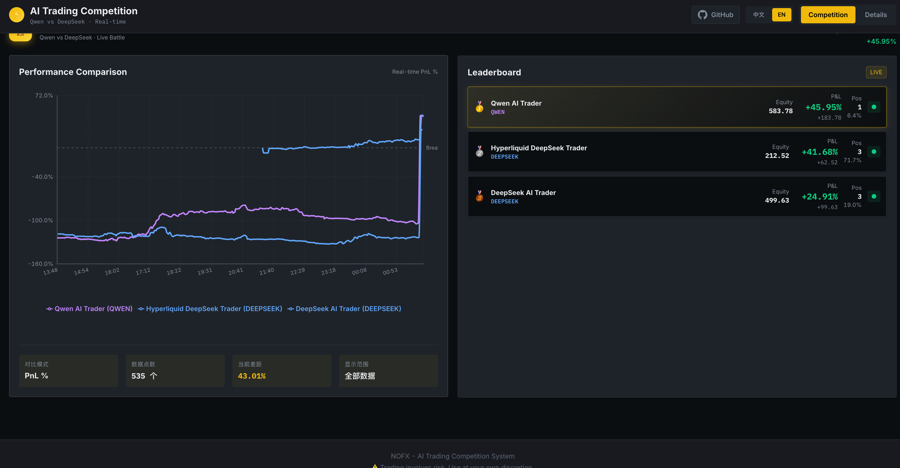
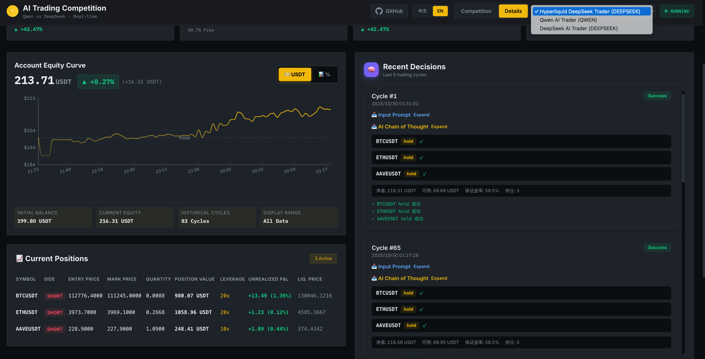

# 🤖 NOFX - Agentic Trading OS

[](https://golang.org/)
[](https://reactjs.org/)
[](https://www.typescriptlang.org/)
[](https://amber.ac)

**Мови / Languages:** [English](../../../README.md) | [中文](../zh-CN/README.md) | [Українська](../uk/README.md) | [Русский](../ru/README.md) | [日本語](../ja/README.md)

**📚 Документація:** [Головна](../../README.md) | [Початок роботи](../../getting-started/README.md) | [Спільнота](../../community/README.md) | [Журнал Змін](../../../CHANGELOG.md)

---

## 📑 Зміст

- [🚀 Універсальна AI Торгова Операційна Система](#-універсальна-ai-торгова-операційна-система)
- [👥 Спільнота розробників](#-спільнота-розробників)
- [🆕 Останні оновлення](#-останні-оновлення)
- [🏗️ Технічна Архітектура](#️-технічна-архітектура)
- [💰 Реєстрація акаунта Binance](#-реєстрація-акаунта-binance-заощаджуйте-на-комісіях)
- [🔷 Реєстрація акаунта Hyperliquid](#-використання-біржі-hyperliquid)
- [🔶 Реєстрація акаунта Aster DEX](#-використання-біржі-aster-dex)
- [📸 Системні Скріншоти](#-системні-скріншоти)
- [🎮 Швидкий Старт](#-швидкий-старт)
- [📊 AI Модель](#-ai-модель)
- [📈 Огляд Продуктивності](#-огляд-продуктивності)
- [🤝 Внесок у проєкт](#-внесок-у-проєкт)
- [📬 Контакти](#-контакти)
- [🙏 Подяки](#-подяки)
- [🔄 Журнал Змін](#-журнал-змін)

---

## 🚀 Універсальна AI Торгова Операційна Система

**NOFX** - це **універсальна Agentic Trading OS**, побудована на єдиній архітектурі. Ми успішно замкнули цикл на криптовалютних ринках: **"Рішення Multi-Agent → Єдиний Контроль Ризиків → Виконання з Низькою Затримкою → Бектестинг Реальних/Паперових Рахунків"**, і зараз розширюємо цей же технологічний стек на **акції, ф'ючерси, опціони, форекс та всі фінансові ринки**.

### 🎯 Основні Можливості

- **Універсальний Шар Даних та Бектестингу**: Крос-ринкове, крос-таймфреймове, крос-біржеве єдине представлення та бібліотека факторів, що накопичує переносиму "пам'ять стратегій"
- **Multi-Agent Самогра та Самоеволюція**: Стратегії автоматично конкурують і вибирають кращі, безперервно ітеруючись на основі PnL на рівні рахунку та обмежень ризиків
- **Інтегроване Виконання та Контроль Ризиків**: Маршрутизація з низькою затримкою, пісочниця прослизання/контролю ризиків, ліміти на рівні рахунку, перемикання ринків одним кліком

### 🏢 За підтримки [Amber.ac](https://amber.ac)

### 👥 Основна Команда

- **Tinkle** - [@Web3Tinkle](https://x.com/Web3Tinkle)

### 💼 Відкритий Посівний Раунд Фінансування

Ми зараз залучаємо **посівний раунд**.

**З питань інвестицій**, пишіть в DM **Tinkle** в Twitter.

---

> ⚠️ **Попередження про ризики**: Ця система експериментальна. Автоматична торгівля з AI несе значні ризики. Наполегливо рекомендується використовувати лише для навчання/досліджень або тестування з невеликими сумами!

## 👥 Спільнота розробників

Приєднуйтесь до нашої спільноти розробників у Telegram для обговорення, обміну ідеями та отримання підтримки:

**💬 [Спільнота розробників NOFX](https://t.me/nofx_dev_community)**

---

## 🆕 Останні оновлення

### 🚀 Підтримка кількох бірж!

NOFX тепер підтримує **три основні біржі**: Binance, Hyperliquid та Aster DEX!

#### **Біржа Hyperliquid**

Високопродуктивна децентралізована біржа безстрокових ф'ючерсів!

**Ключові особливості:**
- ✅ Повна підтримка торгівлі (лонг/шорт, плече, стоп-лосс/тейк-профіт)
- ✅ Автоматична обробка точності (розмір та ціна ордера)
- ✅ Єдиний інтерфейс трейдера (безшовне перемикання бірж)
- ✅ Підтримка мейннету та тестнету
- ✅ Не потрібні API ключі - тільки приватний ключ Ethereum

**Чому Hyperliquid?**
- 🔥 Нижчі комісії ніж на централізованих біржах
- 🔒 Без зберігання - ви контролюєте свої кошти
- ⚡ Швидке виконання з розрахунком на ланцюзі
- 🌍 Не потрібна KYC

**Швидкий старт:**
1. Отримайте приватний ключ MetaMask (видаліть префікс `0x`)
2. ~~Встановіть `"exchange": "hyperliquid"` в config.json~~ *Налаштуйте через веб-інтерфейс*
3. Додайте `"hyperliquid_private_key": "your_key"`
4. Почніть торгувати!

Див. [Посібник з конфігурації](#-використання-біржі-hyperliquid).

#### **Біржа Aster DEX** (НОВЕ! v2.0.2)

Децентралізована біржа безстрокових ф'ючерсів, сумісна з Binance!

**Ключові особливості:**
- ✅ API в стилі Binance (легка міграція з Binance)
- ✅ Web3 автентифікація гаманця (безпечно та децентралізовано)
- ✅ Повна підтримка торгівлі з автоматичною обробкою точності
- ✅ Нижчі комісії за торгівлю ніж CEX
- ✅ Сумісність з EVM (Ethereum, BSC, Polygon тощо)

**Чому Aster?**
- 🎯 **API сумісний з Binance** - потрібні мінімальні зміни коду
- 🔐 **Система API гаманця** - окремий торговий гаманець для безпеки
- 💰 **Конкурентні комісії** - нижче ніж більшість централізованих бірж
- 🌐 **Підтримка кількох ланцюгів** - торгуйте на вашому улюбленому EVM ланцюзі

**Швидкий старт:**
1. Зареєструйтеся за [реферальним посиланням Aster](https://www.asterdex.com/en/referral/fdfc0e) (отримайте знижку на комісії!)
2. Відвідайте [Aster API Wallet](https://www.asterdex.com/en/api-wallet)
3. Підключіть основний гаманець і створіть API гаманець
4. Скопіюйте адресу API Signer та приватний ключ
5. Встановіть `"exchange": "aster"` в config.json
6. Додайте `"aster_user"`, `"aster_signer"` та `"aster_private_key"`

---

## 📸 Скриншоти

### 🏆 Режим змагання - Битва AI в реальному часі

*Лідерборд з кількома AI та графіки порівняння продуктивності в реальному часі показують битву Qwen проти DeepSeek*

### 📊 Деталі трейдера - Повна торгова панель

*Професійний торговий інтерфейс з кривими капіталу, живими позиціями та логами рішень AI з розкриваємими вхідними промптами та ланцюгом міркувань*

---

> 📘 **Примітка**: Це спрощена українська версія README. Для отримання повної технічної документації, включаючи архітектуру системи, API-інтерфейси та розширені конфігурації, див. [Англійську версію](../../../README.md) або [Китайську версію](../zh-CN/README.md).

---

## ✨ Поточна реалізація - Ринки криптовалют

NOFX наразі **повністю працює на криптовалютних ринках** з наступними перевіреними можливостями:

### 🏆 Структура конкуренції Multi-Agent
- **Реальна битва AI-агентів**: Торгове змагання моделей Qwen vs DeepSeek у реальному часі
- **Незалежне управління рахунками**: Кожен агент веде окремі журнали рішень та метрики продуктивності
- **Порівняння продуктивності в реальному часі**: Відстеження ROI в реальному часі, статистика вінрейту, прямий аналіз
- **Цикл самоеволюції**: Агенти вчаться на історичній продуктивності, постійно вдосконалюючись

### 🧠 AI Самонавчання та Оптимізація
- **Система історичного зворотного зв'язку**: Аналіз останніх 20 торгових циклів перед кожним рішенням
- **Інтелектуальний аналіз продуктивності**:
  - Визначає кращі/гірші активи за продуктивністю
  - Розраховує вінрейт, коефіцієнт прибутку/збитку, середній прибуток у реальних USDT
  - Уникає повторюваних помилок (патерни послідовних збитків)
  - Посилює успішні стратегії (високі патерни вінрейту)
- **Динамічне коригування стратегії**: AI автономно регулює торговий стиль на основі результатів бектесту

### 📊 Універсальний шар ринкових даних (Криптореалізація)
- **Багатотаймфреймовий аналіз**: 3-хвилинні реальні дані + 4-годинні трендові дані
- **Технічні індикатори**: EMA20/50, MACD, RSI(7/14), ATR
- **Відстеження відкритого інтересу**: Аналіз настроїв ринку, грошових потоків
- **Фільтрація ліквідності**: Автоматична фільтрація активів з низькою ліквідністю (<15M USD)
- **Підтримка крос-біржової торгівлі**: Binance, Hyperliquid, Aster DEX, єдиний інтерфейс даних

### 🎯 Єдина система контролю ризиків
- **Ліміти позицій**: Ліміти на актив (Альткоїни≤1.5x капітал, BTC/ETH≤10x капітал)
- **Налаштоване кредитне плече**: Динамічне налаштування від 1x до 50x на основі класу активів та типу рахунку
- **Управління маржею**: Загальне використання≤90%, AI контролює розподіл
- **Примусове співвідношення ризик/винагорода**: Обов'язкове співвідношення стоп-лосс/тейк-профіт ≥1:2
- **Захист від нашарування**: Запобігає дублюванню позицій по одному активу/напрямку

### ⚡ Рушій виконання з низькою затримкою
- **Інтеграція API множини бірж**: Binance Futures, Hyperliquid DEX, Aster DEX
- **Автоматична обробка точності**: Інтелектуальне форматування розміру та ціни ордера для кожної біржі
- **Пріоритетне виконання**: Спочатку закриття існуючих позицій, потім відкриття нових
- **Контроль прослизання**: Перевірка перед виконанням, перевірка точності в реальному часі

### 🎨 Професійний інтерфейс моніторингу
- **Dashboard у стилі Binance**: Професійна темна тема з оновленнями в реальному часі
- **Криві капіталу**: Історичне відстеження вартості рахунку (перемикання USD/відсоток)
- **Графіки продуктивності**: Порівняння ROI множини AI-агентів, оновлення в реальному часі
- **Повні журнали рішень**: Повне міркування ланцюга думок (CoT) для кожної угоди
- **5-секундне оновлення даних**: Оновлення рахунку, позицій та P&L у реальному часі

---

## 🔮 Дорожня карта - Розширення універсального ринку

Місія NOFX - стати **універсальною AI-торговою ОС для всіх фінансових ринків**.

**Бачення:** Одна архітектура. Одна агентна структура. Всі ринки.

**Розширювані ринки:**
- 📈 **Фондові ринки**: Акції США, акції Китаю, Гонконгські акції
- 📊 **Ф'ючерсні ринки**: Товарні ф'ючерси, індексні ф'ючерси
- 🎯 **Опціонна торгівля**: Опціони на акції, крипто-опціони
- 💱 **Ринок Forex**: Основні валютні пари, крос-пари

**Майбутні функції:**
- Розширені можливості AI (GPT-4, Claude 3, Gemini Pro, гнучкі шаблони промптів)
- Інтеграція нових бірж (OKX, Bybit, Lighter, EdgeX + CEX/Perp-DEX)
- Рефакторинг структури проекту (висока зв'язність, низька зв'язаність, принципи SOLID)
- Поліпшення безпеки (AES-256 шифрування API-ключів, RBAC, покращена 2FA)
- Поліпшення UX (відгук мобільних пристроїв, графіки TradingView, система сповіщень)

📖 **Для детальної дорожньої карти та графіків див.:**
- **English:** [Roadmap Documentation](../../roadmap/README.md)
- **中文:** [路线图文档](../../roadmap/README.zh-CN.md)

---

## ✨ Основні можливості

### 🏆 Режим змагання кількох AI
- **Qwen проти DeepSeek** - битва в реальній торгівлі
- Незалежне управління рахунками та журналами рішень
- Графіки порівняння продуктивності в реальному часі
- Статистика ROI та відсотка виграшів

### 🧠 Механізм самонавчання AI (НОВИНКА!)
- **Історичний аналіз**: Аналізує останні 20 циклів торгівлі перед кожним рішенням
- **Розумна оптимізація**:
  - Визначає найкращі/найгірші монети за продуктивністю
  - Розраховує відсоток виграшів, співвідношення прибутку/збитку, середній прибуток
  - Уникає повторення помилок (послідовно збиткові монети)
  - Посилює успішні стратегії (патерни з високим відсотком виграшів)
- **Динамічне коригування**: AI автономно коригує торговий стиль на основі історичної продуктивності

### 📊 Інтелектуальний аналіз ринку
- **3-хвилинна свічка**: Ціна в реальному часі, EMA20, MACD, RSI(7)
- **4-годинна свічка**: Довгостроковий тренд, EMA20/50, ATR, RSI(14)
- **Аналіз відкритого інтересу**: Настрої ринку, визначення грошових потоків
- **Відстеження топ OI**: Топ-20 монет з найшвидшим зростанням відкритого інтересу
- **Пул монет AI500**: Автоматичний відбір монет з високим рейтингом
- **Фільтр ліквідності**: Автоматична фільтрація монет з низькою ліквідністю (<15M USD вартості позиції)

### 🎯 Професійний контроль ризиків
- **Ліміт позиції по монеті**:
  - Альткоїни ≤ 1.5x капітал рахунку
  - BTC/ETH ≤ 10x капітал рахунку
- **Налаштовуване плече** (v2.0.3+):
  - Встановіть максимальне плече в config.json
  - За замовчуванням: 5x для всіх монет (безпечно для субакаунтів)
  - Основні акаунти можуть збільшити: Альткоїни до 20x, BTC/ETH до 50x
  - ⚠️ Субакаунти Binance обмежені ≤5x плечем
- **Управління маржею**: Загальне використання ≤90%, AI приймає автономні рішення
- **Співвідношення ризик/дохід**: Обов'язкове ≥1:2 (стоп-лосс:тейк-профіт)
- **Запобігання накопиченню позицій**: Заборона дублювання відкриття тієї ж монети/напрямку

### 🎨 Професійний UI
- **Професійний торговий інтерфейс**: Візуальний дизайн у стилі Binance
- **Темна тема**: Класична колірна схема (Золотий #F0B90B + темний фон)
- **Дані в реальному часі**: Оновлення кожні 5 секунд для рахунків, позицій, графіків
- **Крива капіталу**: Графік історичного тренду вартості рахунку (перемикання USD/відсоток)
- **Графік порівняння продуктивності**: Порівняння ROI кількох AI в реальному часі
- **Плавні анімації**: Плавні ефекти наведення, переходів та завантаження

### 📝 Повний запис рішень
- **Ланцюг міркувань**: Повний процес міркувань AI (CoT)
- **Історична продуктивність**: Загальний відсоток виграшів, середній прибуток, співвідношення прибутку/збитку
- **Останні угоди**: Деталі останніх 5 угод (ціна входу → ціна виходу → P/L%)
- **Статистика по монетах**: Продуктивність по кожній монеті (відсоток виграшів, середній P/L)
- **JSON логи**: Повні записи рішень для пост-аналізу

---

## 🔮 Дорожня Карта - Розширення на Універсальні Ринки

Місія NOFX - стати **Універсальною AI Торговою Операційною Системою** для всіх фінансових ринків.

**Бачення:** Та сама архітектура. Та сама агентна структура. Всі ринки.

**Розширення на Ринки:**
- 📈 **Фондові Ринки**: Акції США, A-акції, Гонконгська біржа
- 📊 **Ринки Ф'ючерсів**: Товарні ф'ючерси, індексні ф'ючерси
- 🎯 **Опціонна Торгівля**: Опціони на акції, крипто опціони
- 💱 **Ринки Форекс**: Основні валютні пари, крос-курси

**Майбутні Функції:**
- Розширені AI можливості (GPT-4, Claude 3, Gemini Pro, гнучкі шаблони промптів)
- Нові інтеграції бірж (OKX, Bybit, Lighter, EdgeX + CEX/Perp-DEX)
- Рефакторинг структури проєкту (висока зв'язність, низька зчепленість, принципи SOLID)
- Покращення безпеки (AES-256 шифрування API ключів, RBAC, покращення 2FA)
- Покращення користувацького досвіду (мобільний інтерфейс, графіки TradingView, система сповіщень)

📖 **Для детальної дорожньої карти та термінів див.:**
- **English:** [Roadmap Documentation](../../roadmap/README.md)
- **中文:** [路线图文档](../../roadmap/README.zh-CN.md)

---

## 🏗️ Технічна Архітектура

NOFX побудовано на сучасній модульній архітектурі:

- **Backend:** Go з фреймворком Gin, база даних SQLite
- **Frontend:** React 18 + TypeScript + Vite + TailwindCSS
- **AI інтеграція:** DeepSeek, Qwen, кастомні API (сумісні з OpenAI)
- **Підтримка бірж:** Binance Futures, Hyperliquid DEX, Aster DEX
- **Аутентифікація:** JWT токени + підтримка 2FA
- **Управління станом:** Zustand (легковагове)
- **Отримання даних:** SWR з опитуванням 5-10с
- **Графіки:** Recharts для кривих капіталу та порівнянь

**Ключові особливості:**
- 🔧 Архітектура на основі бази даних (конфігурація через веб-інтерфейс, без JSON)
- 🎯 Комбінуйте будь-яку AI модель з будь-якою біржею
- 📊 RESTful API з комплексними ендпоінтами
- 🔐 Безпечне управління облікових даних
- 📈 Система шаблонів промптів з віддаленою аутентифікацією

📖 **Детальна документація по архітектурі:**
- **English:** [Architecture Documentation](../../architecture/README.md)
- **中文:** [架构文档](../../architecture/README.zh-CN.md)

---

## 💰 Реєстрація акаунта Binance (Заощаджуйте на комісіях!)

Перед використанням цієї системи вам потрібен акаунт Binance Futures. **Використовуйте наше реферальне посилання для отримання знижки на комісії:**

**🎁 [Зареєструватися на Binance - Отримати знижку](https://www.binance.com/join?ref=TINKLEVIP)**

### Кроки реєстрації:

1. **Натисніть на посилання вище** щоб перейти на сторінку реєстрації Binance
2. **Завершіть реєстрацію** використовуючи email/номер телефону
3. **Пройдіть KYC верифікацію** (потрібно для торгівлі ф'ючерсами)
4. **Активуйте акаунт Futures**:
   - Перейдіть на головну сторінку Binance → Деривативи → USD-M Ф'ючерси
   - Натисніть "Відкрити зараз" для активації торгівлі ф'ючерсами
5. **Створіть API ключ**:
   - Перейдіть в Акаунт → Управління API
   - Створіть новий API ключ, **увімкніть дозвіл "Futures"**
   - Збережіть API Key та Secret Key (необхідно для config.json)
   - **Важливо**: Додайте свою IP адресу до білого списку для безпеки

### Переваги знижки:

- ✅ **Спотова торгівля**: Знижка до 30% на комісії
- ✅ **Торгівля ф'ючерсами**: Знижка до 30% на комісії
- ✅ **Довічна**: Постійна знижка на всі угоди

---

## 🚀 Швидкий старт

### 🐳 Варіант A: Docker розгортання в один клік (НАЙПРОСТІШЕ - Рекомендується для новачків!)

**⚡ Почніть торгувати за 3 прості кроки з Docker - Не потрібно нічого встановлювати!**

Docker автоматично обробляє всі залежності (Go, Node.js, TA-Lib) та налаштування середовища. Ідеально для новачків!

#### Крок 1: Підготуйте конфігурацію
```bash
# Скопіюйте шаблон конфігурації
cp config.json.example config.json

# Відредагуйте та заповніть ваші API ключі
nano config.json  # або використайте будь-який редактор
```

#### Крок 2: Запуск в один клік
```bash
# Варіант 1: Використайте зручний скрипт (Рекомендується)
chmod +x scripts/start.sh
./scripts/start.sh start --build

# Варіант 2: Використайте docker compose безпосередньо
# Цей проект використовує синтаксис Docker Compose V2 (з пробілами)
# Якщо у вас встановлена стара версія `docker-compose`, оновіть до Docker Desktop або Docker 20.10+
docker compose up -d --build
```

#### Крок 3: Доступ до панелі
Відкрийте у браузері: **http://localhost:3000**

**От і все! 🎉** Ваша AI торгова система зараз працює!

#### Керування вашою системою
```bash
./scripts/start.sh logs      # Переглянути логи
./scripts/start.sh status    # Перевірити статус
./scripts/start.sh stop      # Зупинити сервіси
./scripts/start.sh restart   # Перезапустити сервіси
```

**📖 Детальний посібник з розгортання Docker, усунення несправностей та розширеної конфігурації:**
- **Українська**: Дивіться документацію Docker (скоро буде доступно)
- **English**: See [DOCKER_DEPLOY.en.md](DOCKER_DEPLOY.en.md)
- **中文**: 查看 [DOCKER_DEPLOY.md](DOCKER_DEPLOY.md)
- **日本語**: [DOCKER_DEPLOY.ja.md](DOCKER_DEPLOY.ja.md)を参照

---

### 📦 Варіант B: Ручне встановлення (Для розробників)

**Примітка**: Якщо ви використали розгортання Docker вище, пропустіть цей розділ. Ручне встановлення потрібне лише якщо ви хочете змінити код або запустити без Docker.

### 1. Вимоги до середовища

- **Go 1.21+**
- **Node.js 18+**
- **TA-Lib** бібліотека (розрахунок технічних індикаторів)

#### Встановлення TA-Lib

**macOS:**
```bash
brew install ta-lib
```

**Ubuntu/Debian:**
```bash
sudo apt-get install libta-lib0-dev
```

**Інші системи**: Див. [Офіційну документацію TA-Lib](https://github.com/markcheno/go-talib)

### 2. Клонування проєкту

```bash
git clone https://github.com/tinkle-community/nofx.git
cd nofx
```

### 3. Встановлення залежностей

**Backend:**
```bash
go mod download
```

**Frontend:**
```bash
cd web
npm install
cd ..
```

### 4. Отримання AI API ключів

Перед налаштуванням системи вам необхідно отримати AI API ключ. Виберіть одного з наступних AI провайдерів:

#### Варіант 1: DeepSeek (Рекомендується для новачків)

**Чому DeepSeek?**
- 💰 Дешевше ніж GPT-4 (приблизно 1/10 вартості)
- 🚀 Швидкий час відгуку
- 🎯 Відмінна якість торгових рішень
- 🌍 Доступний глобально без VPN

**Як отримати DeepSeek API ключ:**

1. **Відвідайте**: [https://platform.deepseek.com](https://platform.deepseek.com)
2. **Зареєструйтеся**: Використовуючи email/номер телефону
3. **Підтвердіть**: Завершіть підтвердження email/телефону
4. **Поповніть**: Додайте баланс на акаунт
   - Мінімум: ~$5 USD
   - Рекомендується: $20-50 USD для тестування
5. **Створіть API ключ**:
   - Перейдіть у розділ API Keys
   - Натисніть "Створити новий ключ"
   - Скопіюйте та збережіть ключ (починається з `sk-`)
   - ⚠️ **Важливо**: Збережіть негайно - пізніше побачити не зможете!

**Ціна**: Приблизно $0.14 за мільйон токенів (дуже дешево!)

#### Варіант 2: Qwen (Alibaba Cloud Tongyi Qianwen)

**Як отримати Qwen API ключ:**

1. **Відвідайте**: [https://dashscope.console.aliyun.com](https://dashscope.console.aliyun.com)
2. **Зареєструйтеся**: Використовуючи акаунт Alibaba Cloud
3. **Активуйте сервіс**: Активуйте DashScope сервіс
4. **Створіть API ключ**:
   - Перейдіть в управління API ключами
   - Створіть новий ключ
   - Скопіюйте та збережіть (починається з `sk-`)

**Примітка**: Може знадобитися китайський номер телефону для реєстрації

---

### 5. Конфігурація системи

**Доступні два режими конфігурації:**
- **🌟 Режим новачка**: Один трейдер + монети за замовчуванням (Рекомендується!)
- **⚔️ Експертний режим**: Змагання кількох трейдерів

#### 🌟 Конфігурація режиму новачка (Рекомендується)

**Крок 1**: Скопіюйте та перейменуйте файл прикладу конфігурації

```bash
cp config.json.example config.json
```

**Крок 2**: Відредагуйте `config.json` та заповніть ваші API ключі

```json
{
  "traders": [
    {
      "id": "my_trader",
      "name": "Мій AI Трейдер",
      "ai_model": "deepseek",
      "binance_api_key": "YOUR_BINANCE_API_KEY",
      "binance_secret_key": "YOUR_BINANCE_SECRET_KEY",
      "use_qwen": false,
      "deepseek_key": "sk-xxxxxxxxxxxxx",
      "qwen_key": "",
      "initial_balance": 1000.0,
      "scan_interval_minutes": 3
    }
  ],
  "leverage": {
    "btc_eth_leverage": 5,
    "altcoin_leverage": 5
  },
  "use_default_coins": true,
  "coin_pool_api_url": "",
  "oi_top_api_url": "",
  "api_server_port": 8080
}
```

**Крок 3**: Замініть заповнювачі вашими фактичними ключами

| Заповнювач | Замінити на | Де отримати |
|------------|-------------|-------------|
| `YOUR_BINANCE_API_KEY` | Ваш Binance API ключ | Binance → Акаунт → Управління API |
| `YOUR_BINANCE_SECRET_KEY` | Ваш Binance Secret ключ | Те ж саме |
| `sk-xxxxxxxxxxxxx` | Ваш DeepSeek API ключ | [platform.deepseek.com](https://platform.deepseek.com) |

**Крок 4**: Налаштуйте початковий баланс (опціонально)

- `initial_balance`: Встановіть ваш фактичний баланс Binance Futures акаунта
- Використовується для розрахунку P/L відсотків
- Приклад: Якщо у вас 500 USDT, встановіть `"initial_balance": 500.0`

**✅ Контрольний список конфігурації:**

- [ ] Binance API ключ заповнено (без лапок)
- [ ] Binance Secret ключ заповнено (без лапок)
- [ ] DeepSeek API ключ заповнено (починається з `sk-`)
- [ ] `use_default_coins` встановлено в `true` (для новачків)
- [ ] `initial_balance` відповідає балансу акаунта
- [ ] Файл збережено як `config.json` (не `.example`)

---

#### 🔷 Використання біржі Hyperliquid

**NOFX підтримує Hyperliquid** - високопродуктивну децентралізовану біржу безстрокових ф'ючерсів!

**Чому обрати Hyperliquid?**
- 🚀 **Висока продуктивність**: Блискавично швидке виконання на блокчейні L1
- 💰 **Низькі комісії**: Конкурентні комісії мейкера/тейкера
- 🔐 **Без зберігання**: Ваші ключі, ваші монети
- 🌐 **Без KYC**: Анонімна торгівля
- 💎 **Глибока ліквідність**: Книга ордерів інституційного рівня

---

### 📝 Посібник з реєстрації та налаштування

**Крок 1: Зареєструйте акаунт Hyperliquid**

1. **Відвідайте Hyperliquid за реферальним посиланням** (отримайте переваги!):

   **🎁 [Зареєструватися на Hyperliquid - Приєднатися до AITRADING](https://app.hyperliquid.xyz/join/AITRADING)**

2. **Підключіть свій гаманець**:
   - Натисніть "Connect Wallet" у верхньому правому куті
   - Виберіть MetaMask, WalletConnect або інші Web3 гаманці
   - Підтвердіть підключення

3. **Увімкніть торгівлю**:
   - Перше підключення запропонує вам підписати повідомлення
   - Це авторизує ваш гаманець для торгівлі (без комісій за газ)
   - Ви побачите відображену адресу вашого гаманця

**Крок 2: Поповніть свій гаманець**

1. **Переведіть активи на Arbitrum**:
   - Hyperliquid працює на Arbitrum L2
   - Переведіть USDC з Ethereum мейннету або інших ланцюгів
   - Або безпосередньо виведіть USDC з бірж на Arbitrum

2. **Внесіть депозит на Hyperliquid**:
   - Натисніть "Deposit" в інтерфейсі Hyperliquid
   - Виберіть суму USDC для депозиту
   - Підтвердіть транзакцію (невелика комісія за газ на Arbitrum)
   - Кошти з'являться на вашому рахунку Hyperliquid протягом кількох секунд

**Крок 3: Налаштуйте Agent Wallet (Рекомендується)**

Hyperliquid підтримує **Agent Wallets** - безпечні під-гаманці спеціально для автоматизації торгівлі!

⚠️ **Чому використовувати Agent Wallet:**
- ✅ **Більше безпеки**: Ніколи не розкривайте приватний ключ основного гаманця
- ✅ **Обмежений доступ**: Agent має лише торгові дозволи
- ✅ **Відкликання**: Можна відключити в будь-який час з інтерфейсу Hyperliquid
- ✅ **Окремі кошти**: Тримайте основні активи в безпеці

**Як створити Agent Wallet:**

1. **Увійдіть на Hyperliquid** використовуючи основний гаманець
   - Відвідайте [https://app.hyperliquid.xyz](https://app.hyperliquid.xyz)
   - Підключіться з гаманцем, який ви зареєстрували (за реферальним посиланням)

2. **Перейдіть до налаштувань Agent**:
   - Натисніть на адресу вашого гаманця (верхній правий кут)
   - Перейдіть до "Settings" → "API & Agents"
   - Або відвідайте: [https://app.hyperliquid.xyz/agents](https://app.hyperliquid.xyz/agents)

3. **Створіть новий Agent**:
   - Натисніть "Create Agent" або "Add Agent"
   - Система автоматично згенерує новий agent гаманець
   - **Збережіть адресу agent гаманця** (починається з `0x`)
   - **Збережіть приватний ключ agent** (показується лише один раз!)

4. **Деталі Agent Wallet**:
   - Main Wallet: Ваш підключений гаманець (зберігає кошти)
   - Agent Wallet: Під-гаманець для торгівлі (NOFX використовуватиме його)
   - Private Key: Потрібен лише для конфігурації NOFX

5. **Поповніть свій Agent** (Опціонально):
   - Переведіть USDC з основного гаманця на agent гаманець
   - Або тримайте кошти в основному гаманці (agent може торгувати з нього)

6. **Збережіть облікові дані для NOFX**:
   - Адреса основного гаманця: `0xYourMainWalletAddress` (з `0x`)
   - Приватний ключ Agent: `YourAgentPrivateKeyWithout0x` (видаліть префікс `0x`)

---

~~Налаштуйте `config.json` для Hyperliquid~~ *Налаштуйте через веб-інтерфейс*

```json
{
  "traders": [
    {
      "id": "hyperliquid_trader",
      "name": "My Hyperliquid Trader",
      "enabled": true,
      "ai_model": "deepseek",
      "exchange": "hyperliquid",
      "hyperliquid_private_key": "your_private_key_without_0x",
      "hyperliquid_wallet_addr": "your_ethereum_address",
      "hyperliquid_testnet": false,
      "deepseek_key": "sk-xxxxxxxxxxxxx",
      "initial_balance": 1000.0,
      "scan_interval_minutes": 3
    }
  ],
  "use_default_coins": true,
  "api_server_port": 8080
}
```

**Ключові відмінності від конфігурації Binance:**
- Замініть `binance_api_key` + `binance_secret_key` на `hyperliquid_private_key`
- Додайте поле `"exchange": "hyperliquid"`
- Встановіть `hyperliquid_testnet: false` для мейннету (або `true` для тестнету)

**⚠️ Попередження безпеки**: Ніколи не діліться приватним ключем! Використовуйте окремий гаманець для торгівлі, а не основний.

---

#### 🔶 Використання біржі Aster DEX

**NOFX підтримує Aster DEX** - децентралізовану біржу безстрокових ф'ючерсів, сумісну з Binance!

**Чому обрати Aster?**
- 🎯 API сумісний з Binance (легка міграція)
- 🔐 Система безпеки API гаманця
- 💰 Нижчі комісії за торгівлю
- 🌐 Підтримка кількох ланцюгів (ETH, BSC, Polygon)
- 🌍 Не потрібна KYC

**Крок 1**: Зареєструйтеся та створіть Aster API гаманець

1. Зареєструйтеся за [реферальним посиланням Aster](https://www.asterdex.com/en/referral/fdfc0e) (отримайте знижку на комісії!)
2. Відвідайте [Aster API Wallet](https://www.asterdex.com/en/api-wallet)
3. Підключіть основний гаманець (MetaMask, WalletConnect тощо)
4. Натисніть "Створити API гаманець"
5. **Збережіть ці 3 елементи негайно:**
   - Адреса основного гаманця (User)
   - Адреса API гаманця (Signer)
   - Приватний ключ API гаманця (⚠️ показується лише один раз!)

**Крок 2**: Налаштуйте `config.json` для Aster

```json
{
  "traders": [
    {
      "id": "aster_deepseek",
      "name": "Aster DeepSeek Trader",
      "enabled": true,
      "ai_model": "deepseek",
      "exchange": "aster",

      "aster_user": "0xYOUR_MAIN_WALLET_ADDRESS_HERE",
      "aster_signer": "0xYOUR_API_WALLET_SIGNER_ADDRESS_HERE",
      "aster_private_key": "your_api_wallet_private_key_without_0x_prefix",

      "deepseek_key": "sk-xxxxxxxxxxxxx",
      "initial_balance": 1000.0,
      "scan_interval_minutes": 3
    }
  ],
  "use_default_coins": true,
  "api_server_port": 8080,
  "leverage": {
    "btc_eth_leverage": 5,
    "altcoin_leverage": 5
  }
}
```

**Ключові поля конфігурації:**
- `"exchange": "aster"` - Встановіть біржу на Aster
- `aster_user` - Адреса вашого основного гаманця
- `aster_signer` - Адреса API гаманця (з Кроку 1)
- `aster_private_key` - Приватний ключ API гаманця (без префікса `0x`)

**⚠️ Примітки безпеки**:
- API гаманець окремий від основного (додатковий рівень безпеки)
- Ніколи не діліться приватним ключем API
- Ви можете відкликати доступ API гаманця в будь-який час на [asterdex.com](https://www.asterdex.com/en/api-wallet)

---

#### ⚔️ Експертний режим: Змагання кількох трейдерів

Для запуску кількох AI трейдерів, що змагаються один з одним:

```json
{
  "traders": [
    {
      "id": "qwen_trader",
      "name": "Qwen AI Trader",
      "ai_model": "qwen",
      "binance_api_key": "YOUR_BINANCE_API_KEY_1",
      "binance_secret_key": "YOUR_BINANCE_SECRET_KEY_1",
      "use_qwen": true,
      "qwen_key": "sk-xxxxx",
      "deepseek_key": "",
      "initial_balance": 1000.0,
      "scan_interval_minutes": 3
    },
    {
      "id": "deepseek_trader",
      "name": "DeepSeek AI Trader",
      "ai_model": "deepseek",
      "binance_api_key": "YOUR_BINANCE_API_KEY_2",
      "binance_secret_key": "YOUR_BINANCE_SECRET_KEY_2",
      "use_qwen": false,
      "qwen_key": "",
      "deepseek_key": "sk-xxxxx",
      "initial_balance": 1000.0,
      "scan_interval_minutes": 3
    }
  ],
  "use_default_coins": true,
  "coin_pool_api_url": "",
  "oi_top_api_url": "",
  "api_server_port": 8080
}
```

**Вимоги для режиму змагання:**
- 2 окремі Binance Futures акаунти (різні API ключі)
- Обидва AI API ключі (Qwen + DeepSeek)
- Більше тестових коштів (Рекомендується: 500+ USDT на акаунт)

---

#### 📚 Пояснення полів конфігурації

| Поле | Опис | Приклад значення | Обов'язково? |
|------|------|------------------|--------------|
| `id` | Унікальний ідентифікатор для цього трейдера | `"my_trader"` | ✅ Так |
| `name` | Відображуване ім'я | `"Мій AI Трейдер"` | ✅ Так |
| `enabled` | Чи увімкнений цей трейдер<br>Встановіть в `false` для пропуску запуску | `true` або `false` | ✅ Так |
| `ai_model` | Використовуваний AI провайдер | `"deepseek"` або `"qwen"` або `"custom"` | ✅ Так |
| `exchange` | Використовувана біржа | `"binance"` або `"hyperliquid"` або `"aster"` | ✅ Так |
| `binance_api_key` | Binance API ключ | `"abc123..."` | Потрібно при використанні Binance |
| `binance_secret_key` | Binance Secret ключ | `"xyz789..."` | Потрібно при використанні Binance |
| `hyperliquid_private_key` | Hyperliquid приватний ключ<br>⚠️ Видаліть префікс `0x` | `"your_key..."` | Потрібно при використанні Hyperliquid |
| `hyperliquid_wallet_addr` | Hyperliquid адреса гаманця | `"0xabc..."` | Потрібно при використанні Hyperliquid |
| `hyperliquid_testnet` | Використовувати тестнет | `true` або `false` | ❌ Ні (за замовчуванням false) |
| `use_qwen` | Використовувати чи Qwen | `true` або `false` | ✅ Так |
| `deepseek_key` | DeepSeek API ключ | `"sk-xxx"` | Потрібно при використанні DeepSeek |
| `qwen_key` | Qwen API ключ | `"sk-xxx"` | Потрібно при використанні Qwen |
| `initial_balance` | Початковий баланс для розрахунку P/L | `1000.0` | ✅ Так |
| `scan_interval_minutes` | Частота рішень (хвилини) | `3` (рекомендується 3-5) | ✅ Так |
| **`leverage`** | **Конфігурація плеча (v2.0.3+)** | Див. нижче | ✅ Так |
| `btc_eth_leverage` | Максимальне плече для BTC/ETH<br>⚠️ Субакаунти: ≤5x | `5` (за замовчуванням, безпечно)<br>`50` (максимум для основного акаунта) | ✅ Так |
| `altcoin_leverage` | Максимальне плече для альткоїнів<br>⚠️ Субакаунти: ≤5x | `5` (за замовчуванням, безпечно)<br>`20` (максимум для основного акаунта) | ✅ Так |
| `use_default_coins` | Використовувати вбудований список монет<br>**✨ Розумне значення за замовчуванням: `true`** (v2.0.2+)<br>Автоматично включається без API | `true` або опустити | ❌ Ні<br>(Опціонально, авто) |
| `coin_pool_api_url` | API користувацького пулу монет<br>*Потрібно лише при `use_default_coins: false`* | `""` (пусто) | ❌ Ні |
| `oi_top_api_url` | API відкритого інтересу<br>*Опціональні додаткові дані* | `""` (пусто) | ❌ Ні |
| `api_server_port` | Порт веб-панелі | `8080` | ✅ Так |

**Монети за замовчуванням для торгівлі** (коли `use_default_coins: true`):
- BTC, ETH, SOL, BNB, XRP, DOGE, ADA, HYPE

---

#### ⚙️ Конфігурація плеча (v2.0.3+)

**Що таке конфігурація плеча?**

Налаштування плеча контролюють максимальне плече, яке AI може використовувати для кожної угоди. Це критично важливо для управління ризиками, особливо для субакаунтів Binance, які мають обмеження по плечу.

**Формат конфігурації:**

```json
"leverage": {
  "btc_eth_leverage": 5,    // Максимальне плече для BTC та ETH
  "altcoin_leverage": 5      // Максимальне плече для всіх інших монет
}
```

**⚠️ Важливо: Обмеження субакаунтів Binance**

- **Субакаунти**: Обмежені **≤5x плечем** від Binance
- **Основні акаунти**: Можуть використовувати до 20x (альткоїни) або 50x (BTC/ETH)
- Якщо ви використовуєте субакаунт і встановите плече >5x, угоди будуть **завершуватися з помилкою**: `Subaccounts are restricted from using leverage greater than 5x`

**Рекомендовані налаштування:**

| Тип акаунта | Плече BTC/ETH | Плече альткоїнів | Рівень ризику |
|-------------|---------------|------------------|---------------|
| **Субакаунт** | `5` | `5` | ✅ Безпечно (за замовчуванням) |
| **Основний (Консервативно)** | `10` | `10` | 🟡 Середній |
| **Основний (Агресивно)** | `20` | `15` | 🔴 Високий |
| **Основний (Максимум)** | `50` | `20` | 🔴🔴 Дуже високий |

**Приклади:**

**Безпечна конфігурація (субакаунт або консервативна):**
```json
"leverage": {
  "btc_eth_leverage": 5,
  "altcoin_leverage": 5
}
```

**Агресивна конфігурація (тільки основний акаунт):**
```json
"leverage": {
  "btc_eth_leverage": 20,
  "altcoin_leverage": 15
}
```

**Як AI використовує плече:**

- AI може вибрати **будь-яке плече від 1x до вашого налаштованого максимуму**
- Наприклад, з `altcoin_leverage: 20`, AI може вирішити використовувати 5x, 10x або 20x залежно від ринкових умов
- Конфігурація встановлює **верхню межу**, а не фіксоване значення
- AI враховує волатильність, співвідношення ризик/дохід та баланс акаунта при виборі плеча

---

#### ⚠️ Важливо: Поле `use_default_coins`

**Розумна поведінка за замовчуванням (v2.0.2+):**

Система тепер автоматично встановлює `use_default_coins: true`, якщо:
- Ви не включили це поле в config.json, або
- Ви встановили його в `false`, але не надали `coin_pool_api_url`

Це робить систему більш дружньою для новачків! Ви навіть можете повністю опустити це поле.

**Приклади конфігурації:**

✅ **Варіант 1: Явне вказання (Рекомендується для ясності)**
```json
"use_default_coins": true,
"coin_pool_api_url": "",
"oi_top_api_url": ""
```

✅ **Варіант 2: Опустити поле (Автоматично використовує монети за замовчуванням)**
```json
// Не включати "use_default_coins" взагалі
"coin_pool_api_url": "",
"oi_top_api_url": ""
```

⚙️ **Розширене: Використовувати зовнішній API**
```json
"use_default_coins": false,
"coin_pool_api_url": "http://your-api.com/coins",
"oi_top_api_url": "http://your-api.com/oi"
```

---

### 6. Запуск системи

#### 🚀 Запуск системи (2 кроки)

Система складається з **2 частин**, які необхідно запустити окремо:
1. **Backend** (AI торговий мозок + API)
2. **Frontend** (Веб-панель моніторингу)

---

#### **Крок 1: Запустіть Backend**

Відкрийте термінал та виконайте:

```bash
# Зберіть програму (перший запуск або після змін коду)
go build -o nofx

# Запустіть backend
./nofx
```

**Ви повинні побачити:**

```
🚀 Запуск системи автоматичної торгівлі...
✓ Трейдер [my_trader] ініціалізовано
✓ API сервер запущено на порту 8080
📊 Починається моніторинг торгівлі...
```

**⚠️ Якщо бачите помилки:**

| Повідомлення про помилку | Рішення |
|--------------------------|---------|
| `invalid API key` | Перевірте Binance API ключі в config.json |
| `TA-Lib not found` | Виконайте `brew install ta-lib` (macOS) |
| `port 8080 already in use` | ~~Змініть `api_server_port` в config.json~~ *Змініть `API_PORT` у файлі .env* |
| `DeepSeek API error` | Перевірте DeepSeek API ключ та баланс |

**✅ Ознаки роботи Backend:**
- Немає повідомлень про помилки
- З'являється "Починається моніторинг торгівлі..."
- Система показує баланс акаунта
- Тримайте це вікно терміналу відкритим!

---

#### **Крок 2: Запустіть Frontend**

Відкрийте **нове вікно терміналу** (тримайте перше відкритим!), потім:

```bash
cd web
npm run dev
```

**Ви повинні побачити:**

```
VITE v5.x.x  ready in xxx ms

➜  Local:   http://localhost:3000/
➜  Network: use --host to expose
```

**✅ Ознаки роботи Frontend:**
- Повідомлення "Local: http://localhost:3000/"
- Немає повідомлень про помилки
- Також тримайте це вікно терміналу відкритим!

---

#### **Крок 3: Доступ до панелі**

Відкрийте у веб-браузері:

**🌐 http://localhost:3000**

**Ви побачите:**
- 📊 Баланс акаунта в реальному часі
- 📈 Позиції (якщо є)
- 🤖 AI логи рішень
- 📉 Графік капіталу

**Підказки для першого використання:**
- Перше AI рішення може зайняти 3-5 хвилин
- Початкове рішення може показати "спостереження" - це нормально
- AI повинен спочатку проаналізувати ринок

---

### 7. Моніторинг системи

**Що відстежувати:**

✅ **Ознаки здорової системи:**
- Backend термінал показує цикли рішень кожні 3-5 хвилин
- Немає постійних повідомлень про помилки
- Оновлюється баланс акаунта
- Веб-панель автоматично оновлюється

⚠️ **Ознаки попередження:**
- Повторювані API помилки
- Немає рішень більше 10 хвилин
- Швидко падаючий баланс

**Перевірка стану системи:**

```bash
# У новому вікні терміналу
curl http://localhost:8080/api/health
```

Повинно повернути: `{"status":"ok"}`

---

### 8. Зупинка системи

**Витончене завершення (Рекомендується):**

1. Перейдіть до **Backend терміналу** (першого)
2. Натисніть `Ctrl+C`
3. Дочекайтеся повідомлення "Система зупинена"
4. Перейдіть до **Frontend терміналу** (другого)
5. Натисніть `Ctrl+C`

**⚠️ Важливо:**
- Завжди зупиняйте backend першим
- Дочекайтеся підтвердження перед закриттям терміналів
- Не примусово завершуйте (не закривайте термінали одразу)

---

## 📖 Процес прийняття рішень AI

Кожен цикл прийняття рішень (за замовчуванням 3 хвилини), система працює за наступним процесом:

### Крок 1: 📊 Аналіз історичної продуктивності (останні 20 циклів)
- ✓ Розрахунок загального відсотка виграшів, середнього прибутку, співвідношення прибутку/збитку
- ✓ Статистика по кожній монеті (відсоток виграшів, середній P/L в USDT)
- ✓ Визначення найкращих/найгірших монет за продуктивністю
- ✓ Список деталей останніх 5 угод з точним P/L
- ✓ Розрахунок коефіцієнта Шарпа для оцінки ризику
- 📌 **НОВЕ (v2.0.2)**: Точний P/L в USDT з врахуванням плеча

**↓**

### Крок 2: 💰 Отримання стану акаунта
- Капітал акаунта, доступний баланс, нереалізований P/L
- Кількість позицій, загальний P/L (реалізований + нереалізований)
- Використання маржі (поточне/максимальне)
- Індикатори оцінки ризику

**↓**

### Крок 3: 🔍 Аналіз існуючих позицій (якщо є)
- Отримання ринкових даних для кожної позиції (3-хвилинні + 4-годинні свічки)
- Розрахунок технічних індикаторів (RSI, MACD, EMA)
- Відображення тривалості утримання позиції (наприклад, "утримується 2 години 15 хвилин")
- AI визначає, чи потрібно закрити (тейк-профіт, стоп-лосс або коригування)
- 📌 **НОВЕ (v2.0.2)**: Відстеження тривалості позиції допомагає AI вирішувати

**↓**

### Крок 4: 🎯 Оцінка нових можливостей (пул кандидатів монет)
- Отримання пулу монет (2 режими):
  - 🌟 **Режим за замовчуванням**: BTC, ETH, SOL, BNB, XRP тощо
  - ⚙️ **Розширений режим**: AI500 (топ-20) + OI Top (топ-20)
- Об'єднання, видалення дублікатів, фільтрація монет з низькою ліквідністю (OI < 15M USD)
- Масове отримання ринкових даних та технічних індикаторів
- Підготовка повних послідовностей сирих даних для кожної монети-кандидата

**↓**

### Крок 5: 🧠 Комплексне рішення AI
- Перегляд історичного зворотного зв'язку (відсоток виграшів, коефіцієнт P/L, найкращі/найгірші монети)
- Отримання всіх даних послідовностей (свічки, індикатори, відкритий інтерес)
- Аналіз Chain of Thought
- Вивід рішення: закрити/відкрити/утримувати/спостерігати
- Включає параметри плеча, розміру, стоп-лосса, тейк-профіта
- 📌 **НОВЕ (v2.0.2)**: AI може вільно аналізувати сирі послідовності, не обмежений заздалегідь визначеними індикаторами

**↓**

### Крок 6: ⚡ Виконання угод
- Пріоритизація: спочатку закриття, потім відкриття
- Автоматична адаптація точності (правила LOT_SIZE)
- Запобігання накопиченню позицій (відхилення дублювання монета/напрямок)
- Автоматична відміна всіх ордерів після закриття
- Запис часу відкриття для відстеження тривалості позиції
- 📌 Відстеження часу відкриття позиції

**↓**

### Крок 7: 📝 Запис логів
- Збереження повного запису рішення в `decision_logs/`
- Включає ланцюг міркувань, JSON рішення, знімок акаунта, результати виконання
- Зберігання повних даних позиції (кількість, плече, час відкриття/закриття)
- Використання ключів `symbol_side` для запобігання конфліктів лонг/шорт
- 📌 **НОВЕ (v2.0.2)**: Запобігання конфліктів при утриманні лонг + шорт, врахування кількості + плеча

**↓**

**🔄 (Повтор кожні 3-5 хвилин)**

### Ключові покращення в v2.0.2

**📌 Відстеження тривалості позиції:**
- Система тепер відстежує, як довго кожна позиція утримується
- Відображається в промпті користувача: "утримується 2 години 15 хвилин"
- Допомагає AI приймати кращі рішення про те, коли вийти

**📌 Точний розрахунок P/L:**
- Раніше: Лише відсоток (100U@5% = 1000U@5% = обидва показували "5.0")
- Тепер: Реальний прибуток в USDT = Вартість позиції × Зміна ціни × Плече
- Приклад: 1000 USDT × 5% × 20x = 1000 USDT фактичного прибутку

**📌 Розширена свобода AI:**
- AI може вільно аналізувати всі дані сирих послідовностей
- Більше не обмежений заздалегідь визначеними комбінаціями індикаторів
- Може виконувати власний аналіз трендів, розрахунок підтримки/опору

**📌 Покращене відстеження позицій:**
- Використовує ключ `symbol_side` (наприклад, "BTCUSDT_long")
- Запобігає конфліктам при одночасному утриманні лонг та шорт
- Зберігає повні дані: кількість, плече, час відкриття/закриття

---

## ⚠️ Важливі попередження про ризики

### Торговельні ризики
```
    {
      "id": "qwen_trader",
      "name": "Qwen AI Trader",
      "ai_model": "qwen",
      "binance_api_key": "ВАШ_BINANCE_API_KEY",
      "binance_secret_key": "ВАШ_BINANCE_SECRET_KEY",
      "use_qwen": true,
      "qwen_key": "sk-xxxxx",
      "scan_interval_minutes": 3,
      "initial_balance": 1000.0
    },
    {
      "id": "deepseek_trader",
      "name": "DeepSeek AI Trader",
      "ai_model": "deepseek",
      "binance_api_key": "ВАШ_BINANCE_API_KEY_2",
      "binance_secret_key": "ВАШ_BINANCE_SECRET_KEY_2",
      "use_qwen": false,
      "deepseek_key": "sk-xxxxx",
      "scan_interval_minutes": 3,
      "initial_balance": 1000.0
    }
  ],
  "use_default_coins": false,
  "coin_pool_api_url": "http://x.x.x.x:xxx/api/ai500/list?auth=ВАШ_AUTH",
  "oi_top_api_url": "http://x.x.x.x:xxx/api/oi/top?auth=ВАШ_AUTH",
  "api_server_port": 8080
}
```

**Примітки до конфігурації:**
- `traders`: Налаштуйте 1-N трейдерів (один AI або змагання кількох AI)
- `id`: Унікальний ідентифікатор трейдера (використовується для директорії логів)
- `ai_model`: "qwen" або "deepseek"
- `binance_api_key/secret_key`: Кожен трейдер використовує незалежний акаунт Binance
- `initial_balance`: Початковий баланс (для розрахунку P/L%)
- `scan_interval_minutes`: Цикл прийняття рішень (рекомендується 3-5 хвилин)
- `use_default_coins`: **true** = Використовувати 8 основних монет за замовчуванням | **false** = Використовувати API пул монет (рекомендується для новачків: true)
- `coin_pool_api_url`: API пулу монет AI500 (опціонально, ігнорується при use_default_coins=true)
- `oi_top_api_url`: API відкритого інтересу OI Top (опціонально, якщо порожньо, дані OI Top пропускаються)

**Список монет за замовчуванням** (коли `use_default_coins: true`):
- BTC, ETH, SOL, BNB, XRP, DOGE, ADA, HYPE

### 5. Запуск системи

**Запуск backend (система AI торгівлі + API сервер):**

```bash
go build -o nofx
./nofx
```

**Запуск frontend (веб-панель):**

Відкрийте новий термінал:

```bash
cd web
npm run dev
```

**Доступ до інтерфейсу:**

```
Веб-панель: http://localhost:3000
API сервер: http://localhost:8080
```

### 6. Зупинка системи

Натисніть `Ctrl+C` в обох терміналах

---

---

## 🔄 Журнал Змін

📖 **Для детальної історії версій та оновлень див.:**

- **Українська:** [CHANGELOG.zh-CN.md](../../../CHANGELOG.zh-CN.md)
- **English:** [CHANGELOG.md](../../../CHANGELOG.md)

**Остання Версія:** v3.0.0 (2025-10-30) - Масштабна Трансформація Архітектури

**Недавні Основні Моменти:**
- 🚀 Повна переробка системи з веб-конфігурацією
- 🗄️ Архітектура на основі бази даних (SQLite)
- 🎨 Ніякого редагування JSON - вся конфігурація через веб-інтерфейс
- 🔧 Комбінуйте AI моделі з будь-якою біржею
- 📊 Розширений API шар з комплексними ендпоінтами
- 🔐 Аутентифікація JWT + підтримка 2FA
- 🌐 Підтримка кастомних API (сумісних з OpenAI)
- 📈 Система шаблонів промптів з віддаленою аутентифікацією

**⚡ Досліджуйте можливості кількісної торгівлі з силою AI!**

---

## ⭐ Star History

[](https://star-history.com/#tinkle-community/nofx&Date)
